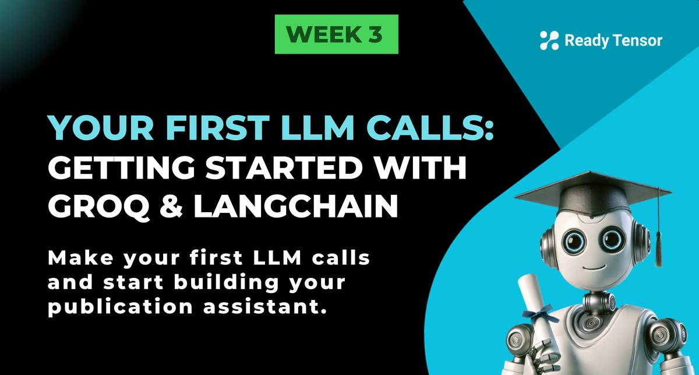

--DIVIDER--

---

[⬅️ Previous - Week 3 Preview](https://app.readytensor.ai/publications/gleIJzLtXA3m)
[➡️ Next - System Prompts](https://app.readytensor.ai/publications/t79Iyg4lva2t)

---

--DIVIDER--

:::info{title="Code Quality + Professional Practice"}

This lesson has a short video attached that shares key insights on coding standards and project hygiene—crucial for your first hands-on work in the program. We recommend reading through the lesson first to understand the technical steps, then watching the video to see how these coding habits will help you build professional, production-grade AI projects.

:::

--DIVIDER--

# TL;DR

In this lesson, you'll learn how to make your first LLM calls with Groq and LangChain, ground your questions in publication content for focused answers, and build natural conversations with proper memory. These are the core building blocks for any RAG-based assistant!

--DIVIDER--

# 🚀 Making Your First LLM Call

Welcome to the hands-on part of our journey! This week, we're finally going to start building. No more theory-only! It's time to write some code and see these concepts come to life.

We'll use **Groq** as our LLM provider (they have great free tiers) and **LangChain** as our framework. Why LangChain? It's one of the foundational frameworks that made LLMs accessible to developers, and you'll likely encounter it in AI engineering interviews. Plus, it integrates beautifully with the modular prompt approach you learned in Week 2.

---

--DIVIDER--

# 🛠️ Setup & Installation

First, let's get the essentials installed:

```python
%pip install langchain-groq langchain pyyaml
```

You'll need a Groq API key — grab one free at [console.groq.com](https://console.groq.com).

--DIVIDER--

## 📚 Import Libraries

````python
from langchain_groq import ChatGroq
from langchain_core.messages import HumanMessage, SystemMessage
import yaml
```

--DIVIDER--

## 🤖 Initialize Your LLM

```python
llm = ChatGroq(
    model="llama-3.1-8b-instant",  # Fast and capable
    temperature=0.7,
    api_key="your_groq_api_key_here"
)
````

---

--DIVIDER--

# 📖 Running Example: VAE Publication

Throughout this lesson, we'll work with questions about **Variational Autoencoders**. This gives us a rich technical topic to test our growing skills. Let's start simple and build up complexity.

--DIVIDER--

:::caution{title="Note on Context and Token Limits"}

In the examples ahead, you’ll see us sending the entire publication content to the LLM as part of the prompt.
This works for small or moderately sized documents, but for longer publications, you may run into token or request limits (especially if you’re using a free Groq account).

If you hit those limits, here’s what you can do:
✅ Truncate or pre-process the publication (e.g., only send the abstract + intro)
✅ Summarize the publication beforehand
✅ Upgrade to a paid tier (like Groq’s Dev Tier) for higher token limits

In future lessons, we’ll explore retrieval-based approaches that dynamically pull only the relevant chunks, making this much more scalable.
:::

--DIVIDER--

## 🔍 **Example 1: A Simple LLM Call**

Let’s start with a general question about VAEs:

```python
from langchain_groq import ChatGroq
from langchain_core.messages import HumanMessage, SystemMessage
import os

# Initialize the LLM
llm = ChatGroq(
    model="llama-3.1-8b-instant",
    temperature=0.7,
    api_key=os.getenv("GROQ_API_KEY")
)

# Basic question
messages = [
    SystemMessage(content="You are a helpful AI assistant."),
    HumanMessage(content="What are variational autoencoders and list the top 5 applications for them?")
]

response = llm.invoke(messages)
print(response.content)

```

--DIVIDER--

**What you’ll see**: A general explanation of VAEs and typical applications, based on the model’s training data.

```txt
**What are Variational Autoencoders (VAEs)?**

Variational Autoencoders (VAEs) are a type of deep learning algorithm that combines the concepts of autoencoders and variational methods. They are neural networks that learn to compress and reconstruct high-dimensional data, such as images or text, into lower-dimensional representations.

The main goal of a VAE is to learn a probabilistic mapping between the input data and a latent space, which is a lower-dimensional representation of the data. The VAE consists of two main components:

1. **Encoder**: Maps the input data to a probability distribution in the latent space.
2. **Decoder**: Maps the latent space representation back to the original input data.

The VAE is trained using a combination of two objectives:

1. **Reconstruction loss**: Measures how well the VAE can reconstruct the original input data.
2. **KL divergence**: Measures the difference between the learned probability distribution in the latent space and a prior distribution.

**Top 5 Applications of Variational Autoencoders:**

1. **Anomaly Detection**: VAEs can be used to detect anomalies or outliers in data by learning a probabilistic model of the normal data distribution. They can identify data points that have a low probability of occurring under the learned model.

2. **Image Generation**: VAEs can be used to generate new images that are similar to a given dataset. They can learn a probabilistic model of the data distribution and sample new images from it.

3. **Dimensionality Reduction**: VAEs can be used to reduce the dimensionality of high-dimensional data, such as images or text, while preserving the most important features of the data.

4. **Clustering and Data Visualization**: VAEs can be used to cluster high-dimensional data into meaningful groups and visualize the data in a lower-dimensional space.

5. **Data Imputation**: VAEs can be used to impute missing values in a dataset by learning a probabilistic model of the data distribution and sampling new values from it.

Some real-world examples of VAE applications include:

* Image generation for artistic styles or faces
* Anomaly detection in industrial sensor data
* Clustering and visualization of customer data in marketing
* Data imputation in healthcare datasets
* Generative modeling of text data for language translation or chatbots.
```

> > Note: You may get different response as LLMs are non-deterministic.

--DIVIDER--

:::tip{title="Try it out!"}

> > Check the output of this:

```py
# View the full response object (metadata)
print(response)
```

The full response object includes **not just the main content**, but also **metadata** like:

- Token counts (prompt & completion)
- Model name
- Response time
- Other details for monitoring, debugging, and cost tracking

This is super useful for monitoring and debugging your applications!

:::

---

--DIVIDER--

## 📄 Example 2: Publication-Specific Questions

Now let's make it more interesting. Imagine we have a publication about VAEs and want to ask specific questions about it:

```python
# Sample publication content (abbreviated for example)
# In the code repo, we will load this from a markdown file.
publication_content = """
Title: One Model, Five Superpowers: The Versatility of Variational Auto-Encoders

TL;DR
Variational Auto-Encoders (VAEs) are versatile deep learning models with applications in data compression, noise reduction, synthetic data generation, anomaly detection, and missing data imputation. This publication demonstrates these capabilities using the MNIST dataset, providing practical insights for AI/ML practitioners.

Introduction
Variational Auto-Encoders (VAEs) are powerful generative models that exemplify unsupervised deep learning. They use a probabilistic approach to encode data into a distribution of latent variables, enabling both data compression and the generation of new, similar data instances.
[rest of publication content... truncated for brevity]
"""

# Same question, grounded in publication context
messages = [
    SystemMessage(content="You are a helpful AI assistant."),
    HumanMessage(content=f"""
Based on this publication: {publication_content}

What are variational autoencoders and list the top 5 applications for them as discussed in this publication.
""")
]

response = llm.invoke(messages)
print(response.content)
```

--DIVIDER--

Now, you will see a response like this one:

```txt
Variational Autoencoders (VAEs) are a type of deep learning algorithm that is used for unsupervised learning tasks. They are particularly useful for learning complex distributions of data and generating new, synthetic data instances that are similar to the original data. The top 5 applications of VAEs discussed in this publication are:

1. **Data Compression**: VAEs can be used to compress complex data into a lower-dimensional latent space, allowing for efficient storage and transmission of data.

2. **Data Generation**: VAEs can generate new, synthetic data instances that are similar to the original data, making them useful for tasks such as data augmentation and synthetic data generation.

3. **Noise Reduction**: VAEs can be used to remove noise from data, making them useful for tasks such as image denoising and signal processing.

4. **Anomaly Detection**: VAEs can be used to detect anomalies in data by learning the distribution of normal data and identifying instances that are outside of this distribution.

5. **Missing Data Imputation**: VAEs can be used to impute missing data by learning the distribution of complete data and generating new values for missing data instances.

These applications demonstrate the versatility of VAEs and their ability to be used in a variety of tasks, from data compression and generation to noise reduction and anomaly detection.
```

**What’s different**: Now the LLM’s answer is grounded in this specific publication, not just general training data.

---

--DIVIDER--

## 🔄 **Example 3: Multi-Turn Conversations**

Finally, let’s build a **multi-turn conversation**. The user asks two questions in sequence, and the LLM uses **contextual memory** to answer.

```python
from langchain_groq import ChatGroq
from langchain_core.messages import HumanMessage, SystemMessage, AIMessage
import os

# Initialize the LLM
llm = ChatGroq(
    model="llama-3.1-8b-instant",
    temperature=0.7,
    api_key=os.getenv("GROQ_API_KEY")
)

# Publication context
publication_content = """
Title: One Model, Five Superpowers: The Versatility of Variational Auto-Encoders

TL;DR
Variational Auto-Encoders (VAEs) are versatile deep learning models with applications in data compression, noise reduction, synthetic data generation, anomaly detection, and missing data imputation. This publication demonstrates these capabilities using the MNIST dataset, providing practical insights for AI/ML practitioners.

Introduction
Variational Auto-Encoders (VAEs) are powerful generative models that exemplify unsupervised deep learning. They use a probabilistic approach to encode data into a distribution of latent variables, enabling both data compression and the generation of new, similar data instances.
[rest of publication content... truncated for brevity]
"""

# Initialize conversation
conversation = [
    SystemMessage(content=f"""
You are a helpful AI assistant discussing a research publication.
Base your answers only on this publication content:

{publication_content}
""")
]

# User question 1
conversation.append(HumanMessage(content="""
What are variational autoencoders and list the top 5 applications for them as discussed in this publication.
"""))

response1 = llm.invoke(conversation)
print("🤖 AI Response to Question 1:")
print(response1.content)
print("\n" + "="*50 + "\n")

# Add AI's response to conversation history
conversation.append(AIMessage(content=response1.content))

# User question 2 (follow-up)
conversation.append(HumanMessage(content="""
How does it work in case of anomaly detection?
"""))

response2 = llm.invoke(conversation)
print("🤖 AI Response to Question 2:")
print(response2.content)
```

**The magic**: The AI remembers the previous context and can answer follow-ups naturally.

--DIVIDER--

<h3>💡 How Does It Work?</h3>

In this example, we’re **appending each new question and response** to the `conversation` list.
Each time we call the LLM, it’s given the **entire conversation history so far** - system prompt, user messages, and AI messages.
This effectively **grows the prompt** with each turn, giving the AI everything it needs to remember what’s been said and answer follow-ups naturally.

This simple pattern, **appending to a list of messages**, is the foundation of how memory works in most LLM frameworks today.

But there's a catch:
🔎 **These conversations can get long** and quickly exceed the model’s context window.

In future lessons, we’ll cover how to **handle memory more efficiently**:

- Summarizing or compressing parts of the conversation
- Using **vector databases** to retrieve relevant context only
- Managing session data to **scale** your assistant beyond the basic conversation window

For now, this is a great way to see how **multi-turn memory** works in practice!

---

--DIVIDER--

# 🎥 Clean Code Foundations for AI Projects (Video)

:::youtube[Code Standards at Ready Tensor]{#bWdc2ObVHVI}

As we start coding for our first hands-on projects in this program, it’s important to make sure your code isn’t just functional—it’s clear, maintainable, and professional.

This short video shares:

✅ The essential standards for project submissions  
 ✅ Why clean, well-documented code matters for real-world AI applications  
 ✅ What goes into a strong, professional GitHub repo  
 ✅ How these coding habits shape your professional image

Watch this before diving into your first project. It’ll help you set the right foundation for everything you build next!

---

--DIVIDER--

# 🎯 Key Takeaways

In this lesson, you've learned:
✅ **Basic LLM calls** with Groq and LangChain
✅ **Grounded questions** by injecting relevant external content into prompts
✅ **Multi-turn conversations** with proper context management

--DIVIDER--

# 🔮 Up Next: Crafting System Prompts

In the next lesson, we'll dive deeper into **system prompts and prompt engineering**. You'll learn how to craft prompts that consistently produce the style, tone, and quality of responses you want - taking your publication assistant from "decent" to "professional."

--DIVIDER--

---

[⬅️ Previous - Week 3 Preview](https://app.readytensor.ai/publications/gleIJzLtXA3m)
[➡️ Next - System Prompts](https://app.readytensor.ai/publications/t79Iyg4lva2t)

---
