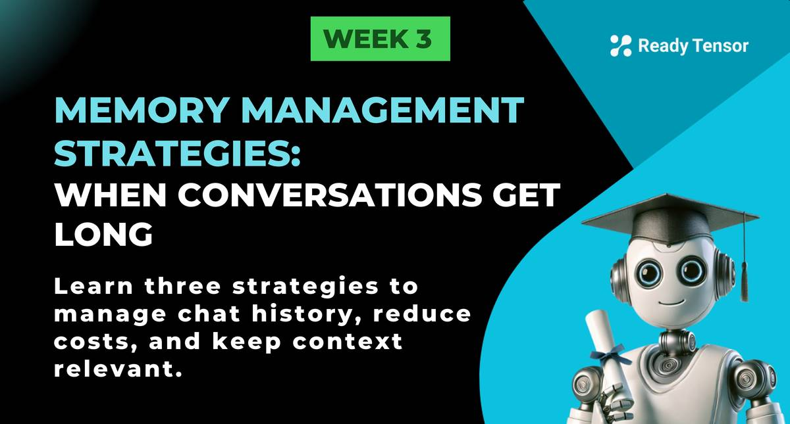
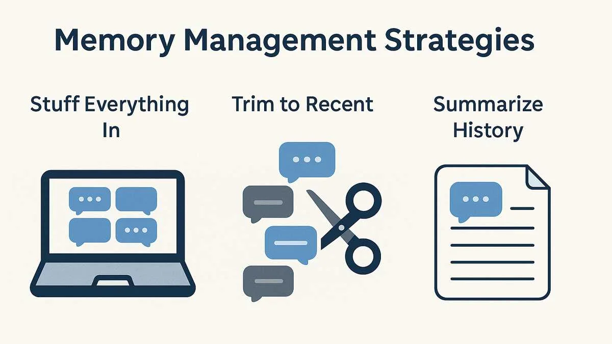

--DIVIDER--

---

[⬅️ Previous - System Prompts](https://app.readytensor.ai/publications/t79Iyg4lva2t)
[➡️ Next - Memory Persistence](https://app.readytensor.ai/publications/Ax1KnCSIt9QI)

---

--DIVIDER--

:::info{title="Code Implementation + Live Testing"}
This lesson has a practical video demonstration at the end that shows how to test and compare different memory strategies (stuffing, trimming, summarization) in a real conversation simulation. We recommend reading through the lesson first to understand the concepts, then watching the video to see how these memory strategies actually impact token usage in practice.
:::

--DIVIDER--

# TL;DR

In this lesson, you'll learn how to manage conversation memory when chat sessions get long. We'll explore three strategies - stuffing everything, trimming to recent messages, and summarizing conversation history - and see how each affects your prompts, costs, and user experience.

--DIVIDER--

# Problem: The Cost of Unlimited Chat History 🚨

In our previous lessons, we built a multi-turn conversation system by simply **stuffing each user/AI interaction into our chat history** and passing the entire thing to the LLM. This works great for short conversations, but what happens when things get longer?

Let's think about a realistic scenario for technical AI assistants: imagine a user having an in-depth conversation about the VAE publication, exploring each of the 5 use cases in detail. Suppose each user-AI interaction adds 500-1,000 tokens to the conversation history. After just 10 turns, you're looking at 5,000-10,000 tokens of history. After 20 turns, that's 10,000-20,000 tokens. After 50+ turns of conversation, we're looking at some serious problems:

**⚠️ Token Limits**
Most models have context limits (4k, 8k, 32k tokens). A long conversation can easily hit these limits, causing your application to break entirely.

**💰 Cost Explosion**
With 50 turns, you're sending 50,000-100,000 tokens of history with every new request. That's expensive and inefficient.

**🧠 Context Pollution**
Early parts of the conversation become irrelevant noise as chat session gets longer. The LLM has to process all that old context, potentially leading to confused or unfocused responses.

**🐌 Performance Issues**
Processing massive context windows is slower and more resource-intensive, leading to poor user experience.

So what should we do? Let's explore three different memory management strategies.

--DIVIDER--

# Three Memory Management Strategies



--DIVIDER--

## 1️⃣ **The “Stuff Everything In” Strategy**

This is our current approach: keep every single message in the conversation history.

```txt
System Prompt: You are a helpful research assistant...

User Turn 1: Tell me about VAE applications
AI Assistant Turn 1: VAEs have 5 major applications including data compression, noise reduction...

User Turn 2: What about data compression specifically?
AI Assistant Turn 2: For data compression, VAEs work by learning efficient representations...

User Turn 3: Can you explain the encoder-decoder architecture?
AI Assistant Turn 3: The encoder maps input data to a latent distribution...

...

User Turn 46: How is it used for missing data imputation?
AI Assistant Turn 46: For missing data imputation, VAEs can reconstruct incomplete samples...
```

This is what we’ve been doing so far:
✅ Simple to implement
❌ Doesn’t scale for long chats
❌ Expensive and can lead to hallucination

You can implement this with LangChain’s **ConversationBufferMemory**:

```python
from langchain.memory import ConversationBufferMemory
from langchain.chains import ConversationChain

memory = ConversationBufferMemory(return_messages=True)
conversation = ConversationChain(llm=llm, memory=memory, verbose=True)
```

---

--DIVIDER--

## 2️⃣ **Trim Older Messages (Sliding Window)**

A common approach is to only keep the most recent "N" messages — like the last 3–5 turns. This is called a sliding window.

```txt
System Prompt: You are a helpful research assistant...

User Turn 44: Explain anomaly detection.
AI Assistant Turn 44: Anomaly detection with VAEs works by...

User Turn 45: And noise reduction?
AI Assistant Turn 45: For noise reduction, VAEs filter...

User Turn 46: What about missing data imputation?
AI Assistant Turn 46: VAEs can reconstruct incomplete samples...
```

This approach:
✅ Reduces prompt size
✅ Keeps context recent and relevant
❌ May lose important older context if the user switches topics back

LangChain’s **ConversationBufferWindowMemory** makes this easy:

```python
from langchain.memory import ConversationBufferWindowMemory

memory = ConversationBufferWindowMemory(k=3, return_messages=True)
conversation = ConversationChain(llm=llm, memory=memory, verbose=True)
```

---

--DIVIDER--

## 3️⃣ **Summarize or Refine Older History**

The most advanced (and often best) approach is to summarize older parts of the conversation — keeping key points, not every word.

Example summarized conversation history:

```txt
System Prompt: You are a helpful research assistant...

Summary of earlier conversation:
- Discussed 5 use cases of VAEs: anomaly detection, noise reduction, data compression, synthetic data generation, and missing data imputation.
- User wanted deep explanations of data compression and anomaly detection.

User Turn 45: Tell me about noise reduction.
AI Assistant Turn 45: For noise reduction, VAEs filter...
```

✅ Retains essential context while shrinking prompt size
✅ Works well for focused, long conversations
❌ Summary generation adds complexity and cost
❌ May lose subtle details in summarization

This strategy can be implemented with LangChain’s **ConversationSummaryMemory**:

```python
from langchain.memory import ConversationSummaryMemory

memory = ConversationSummaryMemory(llm=llm, return_messages=True)
conversation = ConversationChain(llm=llm, memory=memory, verbose=True)
```

---

--DIVIDER--

# Protecting Your System Prompt 🔍

No matter what memory strategy you use, remember:

> **The system prompt should always be retained** — it’s your AI’s North Star.

**Frameworks like LangChain handle this automatically** (the system prompt is always kept separately from conversation memory). So you can focus on managing **user and assistant turns** without worrying about losing the AI’s core behavior and role.

---

--DIVIDER--

# Hands-On Experiment: Comparing Memory Strategies 🧪

To see how these strategies affect **prompt size and performance**, we’ve prepared a demonstration script:

✅ It simulates a long conversation using the **VAE publication questions**.  
 ✅ It runs each memory strategy and saves the final prompt and response.  
 ✅ It also saves a **comparison report** showing how many tokens each strategy uses!

**Watch the live experiment here: 👉**  
 :::youtube[Simulating Memory Strategies: How Conversation History Affects Token Usage]{#ZRMatEAT9bM}

This demo will give you a practical feel for how conversation memory shapes your AI’s behavior — and why understanding token usage is crucial for long-term cost and performance.

---

--DIVIDER--

:::caution{title="Caution"}

 <h3>What About Response Quality?</h3>
 This lesson focused on token usage and performance considerations. We didn't evaluate response accuracy or quality across strategies - that's a topic we'll cover in Module 2 when we dive into evaluation methods for agentic AI systems.
 
:::

--DIVIDER--

# Key Takeaways

✅ **Memory strategies make or break long conversations** - choose based on your use case  
 ✅ **Significant token savings** are achievable with smart memory management  
✅ **Different strategies affect response quality**, not just costs

--DIVIDER--

---

[⬅️ Previous - System Prompts](https://app.readytensor.ai/publications/t79Iyg4lva2t)
[➡️ Next - Memory Persistence](https://app.readytensor.ai/publications/Ax1KnCSIt9QI)

---
