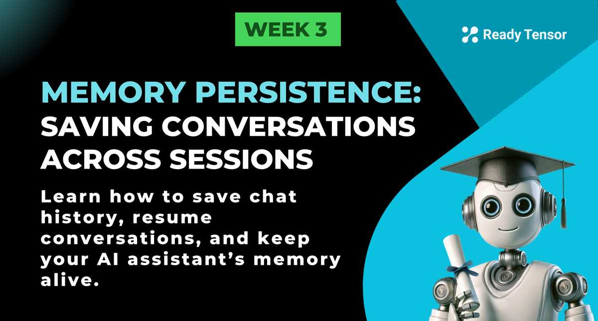

--DIVIDER--

---

[⬅️ Previous - Memory Management Strategies](https://app.readytensor.ai/publications/WCVvtUtH3N1o)
[➡️ Next - RAG Implementation](https://app.readytensor.ai/publications/IBOMURRgN8Dn)

---

--DIVIDER--

# TL;DR

Learn how to save and restore conversation history so users can continue where they left off. This transforms your AI assistant from a one-off tool into a true conversational partner. We’ll cover LangChain’s built-in options and show you how to build custom persistence with databases.

---

--DIVIDER--

# The Persistence Problem

In the previous lesson, we managed memory within a single conversation session. But what happens when a user closes their browser and comes back tomorrow? Without persistence, every conversation starts from scratch.

The solution is to save conversation history to storage that survives beyond the current session.

---

--DIVIDER--

# LangChain’s Built-in Persistence

LangChain provides simple persistence options to get started quickly:

--DIVIDER--

## File-based Storage

```python
from langchain.memory import ConversationBufferMemory
from langchain.memory.chat_message_histories import FileChatMessageHistory

# Save to a file specific to this user/session
memory = ConversationBufferMemory(
    chat_memory=FileChatMessageHistory("chat_history_user123.json"),
    return_messages=True
)

conversation = ConversationChain(llm=llm, memory=memory)
response = conversation.predict(input="What are VAEs?")

# When the user returns, just initialize with the same file
# The conversation history will be automatically loaded
```

✅ **Best for:** small-scale apps, development, or testing
❌ **Not great for production** — doesn’t handle concurrent users well

--DIVIDER--

## SQLite Storage

For more robust persistence, LangChain supports SQLite:

```python
from langchain.memory import ConversationBufferMemory
from langchain.memory.chat_message_histories import SQLChatMessageHistory

# Save to SQLite database
memory = ConversationBufferMemory(
    chat_memory=SQLChatMessageHistory(
        session_id="user123_session456",
        connection_string="sqlite:///chat_history.db"
    ),
    return_messages=True
)

conversation = ConversationChain(llm=llm, memory=memory)
```

✅ **Best for:** small teams, prototypes, or simple production setups
❌ **Limitations:** SQLite’s concurrency limits make it less suitable for high-scale applications

---

--DIVIDER--

## Custom Database Persistence

For production applications, you’ll usually build custom persistence integrated with your existing user system. This lets you:

✅ Save full conversation transcripts for compliance and debugging  
 ✅ Include the **system prompt** alongside user/assistant turns for reproducibility  
 ✅ Add extra metadata for analytics, audit trails, and more

Here’s a **simple example**:

```python
import json
from datetime import datetime

class DatabaseChatMemory:
    def __init__(self, user_id, session_id, db_connection):
        self.user_id = user_id
        self.session_id = session_id
        self.db = db_connection

    def save_message(self, role: str, content: str):
        """Save a single message (including system prompt) to the database."""
        self.db.execute("""
            INSERT INTO chat_messages (user_id, session_id, role, content, timestamp)
            VALUES (%s, %s, %s, %s, %s)
        """, (self.user_id, self.session_id, role, content, datetime.now()))

    def load_conversation(self) -> list:
        """Load the full conversation (including system prompt) in order."""
        result = self.db.execute("""
            SELECT role, content FROM chat_messages
            WHERE user_id = %s AND session_id = %s
            ORDER BY timestamp ASC
        """, (self.user_id, self.session_id))
        return [{"role": row[0], "content": row[1]} for row in result]
```

Schema for this table:

```sql
CREATE TABLE chat_messages (
    id SERIAL PRIMARY KEY,
    user_id VARCHAR(255) NOT NULL,
    session_id VARCHAR(255) NOT NULL,
    role VARCHAR(50) NOT NULL,  -- 'system', 'user', or 'assistant'
    content TEXT NOT NULL,
    timestamp TIMESTAMP DEFAULT CURRENT_TIMESTAMP
);
```

✅ **Best for:** production apps that need to **scale** and **track** conversations — while also meeting **compliance, security, and reproducibility** requirements.

:::tip{title="Persistence Options"}
✅ **Note:** While we showed an example using SQL tables (Postgres, MySQL, SQLite), you can also use **NoSQL options like MongoDB, DynamoDB, or Firestore** if they fit your existing infrastructure better. The key idea is to **persist the conversation data in any reliable storage** so you can **restore and continue** sessions seamlessly.

:::

---

--DIVIDER--

:::info{title="Info"}

 <h3>Why We’re Keeping It Light on Memory Persistence</h3>
 
 We’re keeping this lesson light on persistent memory because we’ll go much deeper into it in **Module 2** when we explore **LangGraph**. LangGraph comes backed by a built-in persistence layer called **checkpointers**. Checkpointers allow you to save the **entire state of a graph** including memory, intermediate steps, and more.
 
 This has two key benefits:
 ✅ **Human-in-the-loop workflows** — Let humans pause and resume agent workflows without losing context.  
 ✅ **Memory across interactions** — For conversations, any new messages can be sent to that checkpoint, which retains all prior memory.
 
 So while we’re showing you the basics here, remember that LangGraph will handle this for you in production-ready workflows.
 
 :::
 
 ---

--DIVIDER--

# Real-World Considerations

When building persistent memory for production, consider:

✅ **Data retention policies** — Don’t store everything forever.  
 ✅ **Privacy and compliance** — Some conversations may need to be encrypted, deleted, or redacted for compliance reasons.  
 ✅ **Performance** — Index by user_id and session_id for fast queries.
✅ **Session management** — Let users view, restart, or delete their conversations.  
 ✅ **Raw transcript storage** — Even if you’re using trimming or summarization for the live conversation, consider **saving the raw chat transcript separately** for compliance, audit, or regulatory reasons.

---

--DIVIDER--

# Key Takeaways

✅ **Persistence** turns your assistant from a stateless tool into a trusted partner
✅ **LangChain** makes it easy to get started with file-based or SQLite storage
✅ **Custom DBs** give you full control for production and compliance
✅ This is your bridge to **smarter, more engaging experiences**

This completes our deep dive into memory management. Next, we'll explore how to build **RAG-based AI Assistant systems with vector databases** for handling larger knowledge bases.

--DIVIDER--

---

[⬅️ Previous - Memory Management Strategies](https://app.readytensor.ai/publications/WCVvtUtH3N1o)
[➡️ Next - RAG Implementation](https://app.readytensor.ai/publications/IBOMURRgN8Dn)

---
