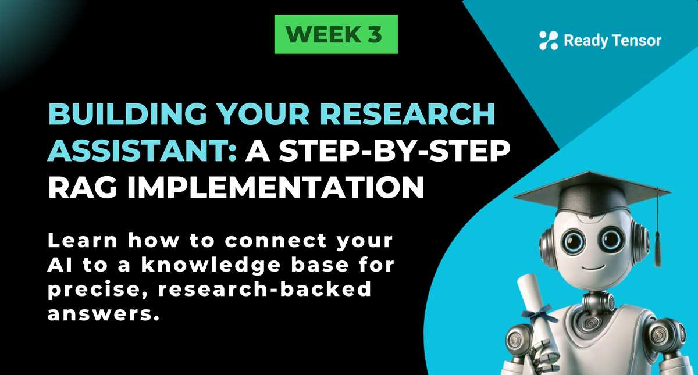

--DIVIDER--

---

[⬅️ Previous - Memory Persistence](https://app.readytensor.ai/publications/Ax1KnCSIt9QI)
[➡️ Next - Project 1 Template](https://app.readytensor.ai/publications/exE2ntdB3aIr)

---

--DIVIDER--

:::info{title="Code Implementation Video Walkthroughs"}
This lesson includes a comprehensive two-part video implementation at the end that walks through building a complete RAG system from scratch. We recommend reading through the lesson first to understand the concepts and architecture, then watching the videos to see how to transform research publications into a working AI assistant that can answer domain-specific questions with source-backed responses.
:::

---

--DIVIDER--

# TL;DR

Learn how to give your AI assistant access to vast knowledge bases so it can answer questions about current events, company policies, and domain-specific information. This transforms your AI from a general conversationalist into a knowledgeable expert that can retrieve and use relevant information on-demand. We'll build a complete RAG pipeline using real research publications.

# The Knowledge Limitation Problem

In the previous lesson, we solved conversation persistence—our AI assistant can now remember past conversations and maintain context across sessions. But there's still a fundamental limitation: our AI is frozen in time at its training cutoff and only knows what it learned during training.

Even with perfect conversation memory, your AI assistant will confidently tell users that the latest iPhone is the iPhone 14, that the president is still Biden, or that it has no knowledge of your company's return policy updated last week.

To overcome this, we need to equip our assistant with the ability to access and retrieve external knowledge in real-time.

---

# 🏗️ Building Our Research Assistant: A Hands-On Journey

To see how this works in practice, let’s build a research assistant for a machine learning team. We'll give it access to a database of Ready Tensor publications covering a range of ML topics, enabling it to retrieve up-to-date, relevant information on demand.

## Step 1: Setting Up the Knowledge Base 📚

First, let's create our vector database and load our publications:

```python
import chromadb
from langchain_text_splitters import RecursiveCharacterTextSplitter
from langchain_huggingface import HuggingFaceEmbeddings

# Initialize ChromaDB
client = chromadb.PersistentClient(path="./research_db")
collection = client.get_or_create_collection(
    name="ml_publications",
    metadata={"hnsw:space": "cosine"}
)

# Set up our embedding model
embeddings = HuggingFaceEmbeddings(
    model_name="sentence-transformers/all-MiniLM-L6-v2"
)
```

**What's happening here?** We're creating a persistent database that will survive restarts and choosing cosine similarity for finding related research content.

## Step 2: Loading the Publications 📖

Before we can chunk our publications, we need to load them from our data directory:

```python
import os
from langchain_community.document_loaders import TextLoader

def load_research_publications(documents_path):
    """Load research publications from .txt files and return as list of strings"""

    # List to store all documents
    documents = []

    # Load each .txt file in the documents folder
    for file in os.listdir(documents_path):
        if file.endswith(".txt"):
            file_path = os.path.join(documents_path, file)
            try:
                loader = TextLoader(file_path)
                loaded_docs = loader.load()
                documents.extend(loaded_docs)
                print(f"Successfully loaded: {file}")
            except Exception as e:
                print(f"Error loading {file}: {str(e)}")

    print(f"\nTotal documents loaded: {len(documents)}")

    # Extract content as strings and return
    publications = []
    for doc in documents:
        publications.append(doc.page_content)

    return publications
```

**What we're doing:** Loading our publications from .txt files using LangChain's TextLoader, extracting the content as strings, and preparing them for chunking. This approach handles any number of .txt files in your documents directory.

## Step 3: Chunking Our Publications 📄

Now that our publications are loaded, let's break them into digestible pieces:

```python
def chunk_research_paper(paper_content, title):
    """Break a research paper into searchable chunks"""

    text_splitter = RecursiveCharacterTextSplitter(
        chunk_size=1000,          # ~200 words per chunk
        chunk_overlap=200,        # Overlap to preserve context
        separators=["\n\n", "\n", ". ", " ", ""]
    )

    chunks = text_splitter.split_text(paper_content)

    # Add metadata to each chunk
    chunk_data = []
    for i, chunk in enumerate(chunks):
        chunk_data.append({
            "content": chunk,
            "title": title,
            "chunk_id": f"{title}_{i}",
        })

    return chunk_data
```

**Why chunk?** Instead of searching through a 20-page paper, we search focused sections about specific techniques like SMOTE or threshold calibration.

## Step 4: Creating Embeddings 🔍

Now we convert our text chunks into vector embeddings that capture semantic meaning:

```python
import torch
from langchain_huggingface import HuggingFaceEmbeddings

def embed_documents(documents: list[str]) -> list[list[float]]:
    """
    Embed documents using a model.
    """
    device = (
        "cuda"
        if torch.cuda.is_available()
        else "mps" if torch.backends.mps.is_available() else "cpu"
    )
    model = HuggingFaceEmbeddings(
        model_name="sentence-transformers/all-MiniLM-L6-v2",
        model_kwargs={"device": device},
    )

    embeddings = model.embed_documents(documents)
    return embeddings
```

**The magic:** Each chunk becomes a 384-dimensional vector that captures its semantic meaning. Similar research concepts get similar vectors, even with different words.

## Step 5: Storing in Vector Database 💾

Now we store our chunks and their embeddings in ChromaDB for fast retrieval:

```python
def insert_publications(collection: chromadb.Collection, publications: list[str]):
    """
    Insert documents into a ChromaDB collection.

    Args:
        collection (chromadb.Collection): The collection to insert documents into
        publications (list[str]): The documents to insert

    Returns:
        None
    """
    next_id = collection.count()

    for publication in publications:
        chunked_publication = chunk_publication(publication)
        embeddings = embed_documents(chunked_publication)
        ids = list(range(next_id, next_id + len(chunked_publication)))
        ids = [f"document_{id}" for id in ids]
        collection.add(
            embeddings=embeddings,
            ids=ids,
            documents=chunked_publication,
        )
        next_id += len(chunked_publication)
```

**What's happening:** We're storing each chunk with its embedding and a unique ID. ChromaDB indexes everything for fast similarity search later.

## Step 6: Intelligent Retrieval 🎯

When researchers ask questions, we find the most relevant content:

```python
def search_research_db(query, collection, embeddings, top_k=5):
    """Find the most relevant research chunks for a query"""

    # Convert question to vector
    query_vector = embeddings.embed_query(query)

    # Search for similar content
    results = collection.query(
        query_embeddings=[query_vector],
        n_results=top_k,
        include=["documents", "metadatas", "distances"]
    )

    # Format results
    relevant_chunks = []
    for i, doc in enumerate(results["documents"][0]):
        relevant_chunks.append({
            "content": doc,
            "title": results["metadatas"][0][i]["title"],
            "similarity": 1 - results["distances"][0][i]  # Convert distance to similarity
        })

    return relevant_chunks
```

**What you'll see:** The system finds chunks about SMOTE, threshold calibration, and class weights from your research database.

## Step 7: Generating Research-Backed Answers 🤖

Finally, we combine retrieved knowledge with an LLM:

```python
from langchain_groq import ChatGroq
from langchain.prompts import PromptTemplate

def answer_research_question(query, collection, embeddings, llm):
    """Generate an answer based on retrieved research"""

    # Get relevant research chunks
    relevant_chunks = search_research_db(query, collection, embeddings, top_k=3)

    # Build context from research
    context = "\n\n".join([
        f"From {chunk['title']}:\n{chunk['content']}"
        for chunk in relevant_chunks
    ])

    # Create research-focused prompt
    prompt_template = PromptTemplate(
        input_variables=["context", "question"],
        template="""
Based on the following research findings, answer the researcher's question:

Research Context:
{context}

Researcher's Question: {question}

Answer: Provide a comprehensive answer based on the research findings above.
"""
    )

    # Generate answer
    prompt = prompt_template.format(context=context, question=query)
    response = llm.invoke(prompt)

    return response.content, relevant_chunks

# Initialize LLM and get answer
llm = ChatGroq(model="llama3-8b-8192")
answer, sources = answer_research_question(
    "What are effective techniques for handling class imbalance?",
    collection,
    embeddings,
    llm
)

print("AI Answer:", answer)
print("\nBased on sources:")
for source in sources:
    print(f"- {source['title']}")
```

**The payoff:** Your AI now answers with specific findings from your research database rather than generic knowledge!

---

# 🎬 The Result: Your Research Assistant in Action

**Before RAG:**

```txt
Researcher: "What's the best method for class imbalance?"
AI: "Common approaches include oversampling, undersampling, and cost-sensitive learning..."
```

**After RAG:**

```txt
Researcher: "What's the best method for class imbalance?"
AI: "Based on recent research in your database, Decision Threshold Calibration
emerged as the most consistently effective technique, performing best for 40%
of datasets in a comprehensive study. The research compared SMOTE, Class Weights,
and Threshold Calibration across 15 models and 30 datasets..."

Sources: Balancing the Scales: Class Imbalance Study
```

Your AI assistant is now grounded in your specific research, giving precise, source-backed answers instead of generic responses.

---

--DIVIDER--

# 🧪 Hands-On Implementation: Building Your Complete RAG Pipeline

To see how RAG works in practice, we've prepared a **two-part implementation walkthrough** that takes you from raw documents to intelligent responses:

✅ **Part 1** covers the complete **data insertion pipeline** — chunking publications, creating embeddings, and storing in ChromaDB  
 ✅ **Part 2** demonstrates **retrieval and response generation** — querying your database, handling different scenarios, and tuning parameters  
 ✅ You'll see **real code execution**, actual token counts, and live parameter adjustments!

**Watch the complete implementation here: 👉**

 <h3>RAG Implementation Walkthrough - Part 1: Building Your Vector Database</h3>
 
 :::youtube[RAG Implementation Walkthrough - Part 1: Building Your Vector Database]{#0TuESd2ZwPs}
 
 <h3>RAG Implementation Walkthrough - Part 2: Retrieval and Answer Generation</h3>
 
 :::youtube[RAG Implementation Walkthrough - Part 2: Retrieval and Answer Generation]{#nnSSLrbxgQE}
 
 ---

--DIVIDER--

# 📋 Key Takeaways

✅ **RAG transforms generic AI into domain experts** by connecting them to specific knowledge

✅ **The pipeline is straightforward:** chunk documents → create embeddings → store in vector DB → retrieve + generate

✅ **Code implementation is accessible** using libraries like ChromaDB and LangChain

✅ **Real impact:** Researchers get precise, source-backed answers from their curated database

✅ **Production-ready:** Add error handling, performance monitoring, and multi-format support

--DIVIDER--

---

[⬅️ Previous - Memory Persistence](https://app.readytensor.ai/publications/Ax1KnCSIt9QI)
[➡️ Next - Project 1 Template](https://app.readytensor.ai/publications/exE2ntdB3aIr)

---
