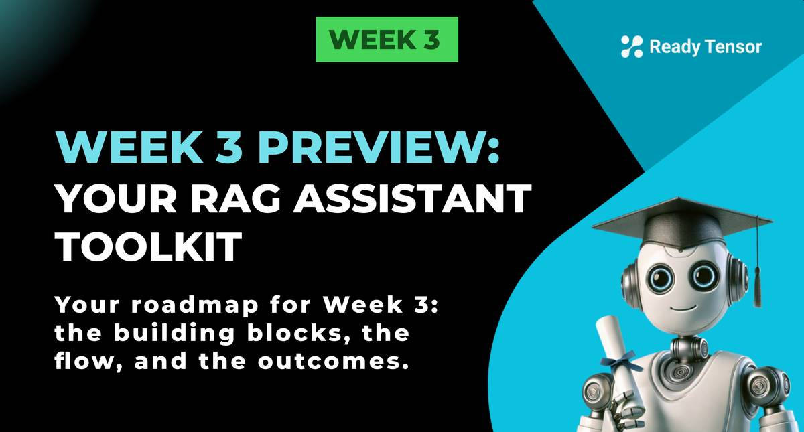

--DIVIDER--

---

[⬅️ Previous - Intro to RAG](https://app.readytensor.ai/publications/3Ht58iNXuvS7)
[➡️ Next - Your First LLM Calls](https://app.readytensor.ai/publications/BJbtjKH15JHb)

---

--DIVIDER--

# Week 3 Preview: Your RAG Assistant Toolkit

Welcome to Week 3! This week, we’re going to move beyond theory and start putting the pieces together.

--DIVIDER--

# 📝 What’s in store this week?

You’ll learn how to:

✅ Make your first LLM calls and get comfortable with Groq and LangChain
✅ Use system prompts to shape your assistant’s style and responses
✅ Manage conversation memory for longer interactions
✅ Bring in **retrieval** to select the most relevant parts of a publication using vector databases like Chroma
✅ Keep your system safe, secure, and robust
✅ Explore best practices for optimizing and scaling your assistant

--DIVIDER--

# 🛠️ Our running example

Throughout these lessons, we'll anchor our examples in a **practical scenario**:

> Building an assistant that can answer questions about a research publication — think "What's the main contribution?" or "How does this methodology work?" or "Can you explain this result?"

We'll use a publication about **Variational Autoencoders** as our test case. This gives us rich technical content to work with and multiple types of questions to handle.

--DIVIDER--

# 🧠 The progression

Here's how we'll build up your skills:

**Lesson 1**: Start simple — basic LLM calls
**Lesson 2**: Craft system prompts
**Lesson 3a**: Manage chat memory
**Lesson 3b**: Persist conversation memory  
 **Lesson 4**: Bring in a vector database and RAG to handle large knowledge bases

--DIVIDER--

# 🚀 What you'll be able to build?

By the end of this week, you'll have **a complete toolkit** of essential techniques, best practices, and real-world patterns that you can use to build your own assistants for publication Q&A, customer support, or any domain you care about.

Let's get started!

--DIVIDER--

---

[⬅️ Previous - Intro to RAG](https://app.readytensor.ai/publications/3Ht58iNXuvS7)
[➡️ Next - Your First LLM Calls](https://app.readytensor.ai/publications/BJbtjKH15JHb)

---
